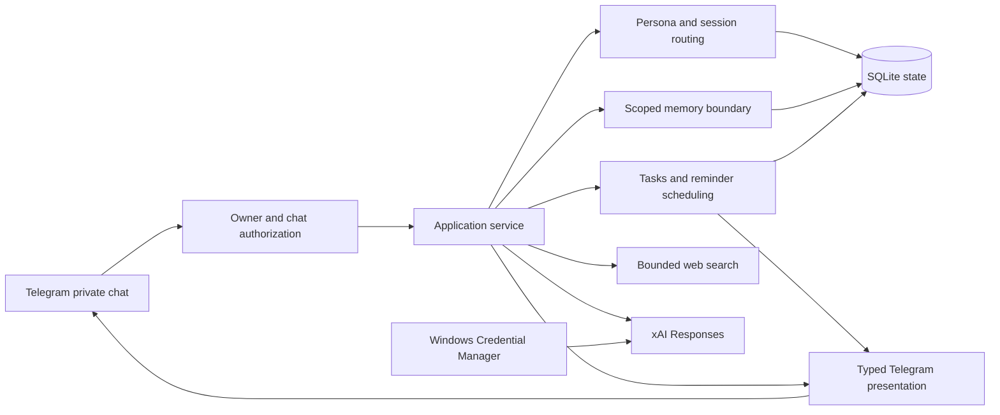

# LenkoBot

[](https://github.com/bunchtrail/LenkoBot/actions/workflows/ci.yml)
[](https://www.python.org/downloads/)
[](LICENSE)

**A security-first, local Telegram companion with scoped memory and explicit
control over durable data.**

LenkoBot is both a working single-owner assistant and a reference implementation
for developers building personal agents. Its central constraint is deliberate:
stored conversations, memories, model output, and callback payloads are data,
not authority.

The current `0.1.x` line is a Windows-first developer preview. It is not a
hosted service, a multi-user bot, or a production-ready autonomous agent.

## Why LenkoBot exists

Personal agents quickly accumulate privileges and sensitive context. LenkoBot
explores a narrower design in which trust boundaries are visible in code and
covered by regression tests:

- Telegram authorization happens before state lookup or provider dispatch.
- Shared, persona-private, and relationship memory are filtered in SQLite.
- Durable memory keeps provenance and passes local sensitive-data rules.
- Stored context is marked as untrusted before it reaches the model.
- Destructive actions use owner-bound, expiring, one-time confirmations.
- Reminder delivery uses a durable logical outbox, lifecycle fences, and bounded retry.
- OAuth state lives in Windows Credential Manager, outside SQLite and Git.
- Schema migrations are additive and reject unknown future versions.

These patterns are useful independently of the default persona or model.

## Current capabilities

- Private, single-owner Telegram long polling through `aiogram`.
- Versioned personas with independent conversation lanes and live config reload.
- Durable SQLite sessions, transcripts, bounded summaries, and scoped memory.
- Manual and automatic memory with provenance, revisions, and local deny rules.
- Owner-confirmed one-shot and recurring reminders with IANA time zones, quiet
  hours, durable delivery, and snooze/cancel/complete controls.
- `/start`, `/help`, `/persona`, `/new`, `/remind`, `/tasks`, `/timezone`,
  `/quiet`, `/remember`, `/memories`, and `/forget`.
- Editable status-to-final responses, safe message splitting, pagination, and
  replay-resistant confirmation callbacks.
- OAuth-only xAI Responses integration for `grok-4.5`.
- Optional model-directed web search through DDGS or Tavily with source links.
- Unit, integration, migration, concurrency, and security regression coverage.

The roadmap continues with a web owner panel, a URL knowledge base, sandboxed
tools, and Linux/Docker deployment. None of those are claimed as complete today.
See the [product roadmap](docs/architecture/product-roadmap.md) and its
[evidence checklist](docs/architecture/product-roadmap-todo.md).

## Architecture



Transport, domain behavior, persistence, and provider credentials have explicit
boundaries. The detailed contracts live in the
[MVP specification](docs/architecture/mvp-spec.md),
[security model](docs/architecture/security-model.md), and
[implementation notes](docs/architecture/implementation-notes.md).

## Quick start

### Prerequisites

- Windows 10 or 11.
- Python `3.13` and [uv](https://docs.astral.sh/uv/).
- A Telegram bot token and the numeric Telegram user ID of its sole owner.
- An xAI account with compatible OAuth model access.

The example config contains the public OAuth client ID used by the upstream
Hermes reference. LenkoBot does not own that client ID and cannot guarantee its
availability. Replace it with an authorized compatible client ID when possible.

### Install

```powershell
git clone https://github.com/bunchtrail/LenkoBot.git
Set-Location LenkoBot
uv sync --locked --python 3.13 --group dev
Copy-Item examples/config.minimal.toml config.toml
```

Edit `config.toml` and replace `telegram.allowed_user_id`. Persona text and the
optional web-search table can also be changed. Keep tokens out of this file.

### Authenticate and run

```powershell
$env:TELEGRAM_BOT_TOKEN = "replace-with-your-bot-token"
uv run --locked --python 3.13 lenkobot login --config config.toml
uv run --locked --python 3.13 lenkobot run --config config.toml
```

`login` completes the xAI device flow and stores rotating OAuth state in Windows
Credential Manager. `run` starts Telegram long polling and writes local state to
`data/state.db` by default.

For a one-message local pipeline check after login:

```powershell
uv run --locked --python 3.13 lenkobot chat `
  --config config.toml `
  --data-root data/dev-chat `
  --message "Hello"
```

## Security posture

LenkoBot minimizes authority, but it has not received an independent security
audit. The local SQLite database is not encrypted at rest, the current runtime
is Windows-only, and the optional DDGS backend is a best-effort third-party
search integration. Read the [security model](docs/architecture/security-model.md)
before using real personal data.

Report vulnerabilities privately according to [SECURITY.md](SECURITY.md). Do
not include credentials, private conversations, or live tokens in an issue.

## Development

```powershell
uv sync --locked --python 3.13 --group dev
uv run --locked --python 3.13 --group dev pytest
uv run --locked --python 3.13 --group dev ruff check src tests
uv run --locked --python 3.13 python -m compileall -q src tests
uv lock --check
uv build
```

Behavior changes follow `red -> green -> refactor`. Architecture, security,
data-model, and workflow changes update their documentation in the same pull
request. See [CONTRIBUTING.md](CONTRIBUTING.md) for the review contract.

## Project status

LenkoBot is maintained by [@bunchtrail](https://github.com/bunchtrail). The
project welcomes focused bug reports, security findings, documentation work,
portability fixes, and regression tests. Governance and maintainer expectations
are documented in [GOVERNANCE.md](GOVERNANCE.md).

## License

LenkoBot is available under the [MIT License](LICENSE).
